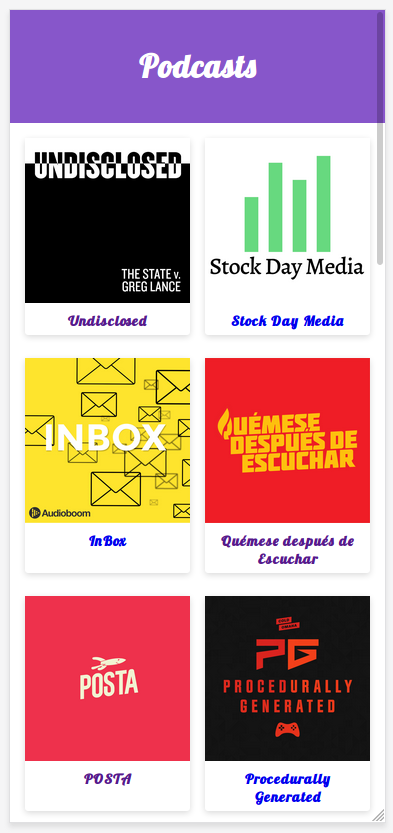

# App de Podcasts

App de Podcast integrada con la API de AudioBoom con la finalidad de mostrar las habilidades de Next.JS

[Ver la aplicación](https://podcastnextjs.gventuraagramonte.now.sh/)

## ¿Cómo funciona?
Requiere Node JS 10

* `npm install` para instalar las dependencias.
* `npm run dev` para el entorno de desarrollo.
* `npm run build && npm start` para el entorno de producción.

## Licencia

MIT